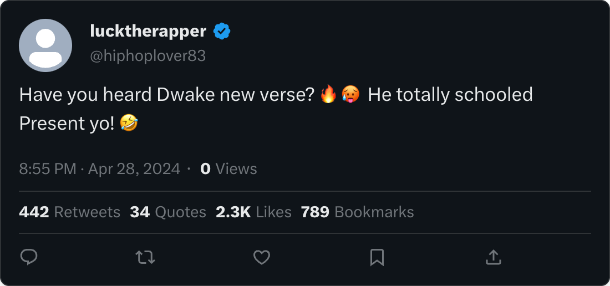

# A Rap Beef

# Enough beef for a burger

## Question 1

Two hip-hop artists, Dwake and Present, are in the midst of a musical feud. Following long-stewing tensions between the artists, they have begun taking jabs at each other through their music.

Dwake, who is signed with OWL Records, was the first to strike. His newest song was intended to insult his arch-nemesis, Present, who is signed with Dollar Currency Records. However, he made a crucial mistake in his verse that took the feud in a different direction.

As a Security Analyst for OWL Records, your job is to keep the company's information safe so your artists don't get exposed during this ongoing feud.

## Question 2

After dropping this verse, Dwake had everyone on social media talking and laughing at Present.

🎶     Yo, Present, you don't know where I'm from,

Got the Washington name from my mom's side, son.

It makes sense why they call you present

Cause you're so easy to beat, its pretty much a gift

Used to play with little Fluffy, now I'm runnin' with the wolves,

You say you're on top, but I'm breakin' all the rules.

I'm on that next level, you're stuck in the past,

with those weak beats you won't last.

🎶



## Question 3

In a fit of anger, Present asked his label, Dollar Currency Records (DCR), to dig up some dirt on Dwake that he could use to retaliate.

Your homeboy (who works in the cyber underground) gave you a tip that you might see nefarious cyber activity as a result.

After sliding him a crisp $20 bill, he recounted a rumor he heard that DCR had hired a hacker who used the IP `18.66.52.227` to poke around your website in early April.

## Question 4

At this point, we'll start digging into the company's data to find clues that will help us solve the mysteries at hand.

We'll use KQL (Kusto Query Language) queries to manipulate our data. Don't worry, we'll provide all the queries in this game, so you don't need to learn how to write them yourself… yet.

For each query we provide, you can simply copy and paste it into the query pane on the right, and then click `run`. You can use the `control-v` shortcut to paste.

Let's take this for a spin. The following query searches for all information about the CEO of OWL Records.

```sql
Employees
| where role == "CEO"|
```

**What is the name of the OWL Records CEO?**

> `Sean Crater`
> 

```yaml
"hire_date": 2021-05-06T00:00:00.000Z,
"name": Sean Crater,
"user_agent": Mozilla/5.0 (Windows NT 6.3; WOW64; rv:45.0) Gecko/20100101 Firefox/45.0,
"ip_addr": 10.10.0.2,
"email_addr": sean_crater@owl-records.com,
"company_domain": owl-records.com,
"username": secrater,
"role": CEO,
"hostname": VMDR-LAPTOP
```

<aside>
💡

Before getting started, we look at all the available tables and look for all the fields it contains:


To look for field it contains, we use the query:

```sql
<Table name>
| take 10
```


</aside>

## Question 5

You can use the following query to search for browsing activity to your company's website.

```yaml
InboundNetworkEvents
| **where** timestamp **between** (datetime("2024-04-10T00:00:00") .. datetime("2024-04-11T00:00:00"))
| **where** src_ip has "18.66.52.227"
```

**How many results (rows) did you get back?**

> `19`
> 

## Question 6

The results you are looking at represent someone browsing and searching for information on OWL Records' website.

This operator (person browsing the website) was clearly looking to find information about various artists who work for OWL Records, especially Dwake. Thanks to the homie, it looks like we are on the right path.

Here we want you to read carefully through the logs to see what the bad guys were searching for.

**What piece of information were they looking to get for Dwake? (two words - might be used for communication)**

> `email address`
> 


## Question 7

Let's continue to look at the results from the previous query.

The operator here also expressed their strong opinions about Dwake's music.

**The operator is wondering why Dwake's music is so _**

> `trash`
> 


## Question 8

Let's continue to look at these logs. At some point the operator discovered Dwake's email address.

**What is Dwake's email address?**

You can look at the results from the previous query to find it!

> `dwake_audrey@owl-records.com`
> 


## Question 9

The operator then attempted to take over Dwake's account by resetting his password. We know this because of the `reset-password` parameter in that last `url` they accessed.

When employees at OWL records need to reset their passwords, they must answer a set of challenge questions to prove who they are. These are the challenge questions offered on the OWL records website:

1. What is your mother's maiden name?
2. What street did you grow up on as a child?
3. What is your childhood pet's name?
4. What is the color of your first car?

Holy smokes! It looks like Dwake may have inadvertently disclosed some of this information in his last verse.

```yaml
🎶     Yo, Present, you don't know where I'm from,

Got the Washington name from my mom's side, son.

It makes sense why they call you present

Cause you're so easy to beat, its pretty much a gift

Used to play with little Fluffy, now I'm runnin' with the wolves,

You say you're on top, but I'm breakin' all the rules.

I'm on that next level, you're stuck in the past,

with those weak beats you won't last.

🎶
```

**Which of the following did Dwake disclose in his verse? (pick one)**

1 and 2

2 and 3

1 and 3

2 and 4

> `1 and 3`
> 

## Question 10

Looking at the verse, let's try to figure out what values the operator may have tried to use to reset Dwake's password.

> `Washington`
> 

## Question 11

**What is the name of Dwake's childhood pet?**

> `Fluffy`
> 

## Question 12

**Copy and paste the full URL that shows the operator resetting the password to Dwake’s account.**

> `https://owl-records.com/account/security-questions?question_1=mother's+maiden+name&answer_1=Washington&question_2=first+pet's+name&answer_2=Fluffy`
> 

```yaml
"timestamp": 2024-04-10T13:02:47.000Z,
"method": GET,
"src_ip": 18.66.52.227,
"user_agent": Mozilla/5.0 (compatible; MSIE 6.0; Windows NT 6.2; Trident/5.0),
"url": https://owl-records.com/account/security-questions?question_1=mother's+maiden+name&answer_1=Washington&question_2=first+pet's+name&answer_2=Fluffy,
"status_code": 200
```

## Question 13

After taking over Dwake's email account, the operator was able to reset the password of Dwake's Instagram account as well.

The following day, the adversaries posted an embarrassing image to Drake's Instagram.


# Less beef, more phish

## Question 1

The higher ups at OWL records deliberated the happening in a private meeting. In that meeting was Dwake himself who was seething about what had taken place.

After 6 hours of deliberation, the company declared it a settled issue. However, they never officially specified how they dealt with the situation.

The following day, a random hacker on the dark web threatened to release damaging information on Present the rapper, if he did not announce his retirement in the next 30 days.


## Question 2

You can't prove OWL Record management had anything to do with the dark web post (nor do you have any incentive to do so), however you understand that this will spell more trouble for you.

You go back and talk to the homie, and he suggests that any retaliation would happen via phishing. This is a vague hint, but you can surely do something with this.

## Question 3

Let's find the phish!

We already know one thing about the adversary! They used IP `18.66.52.227` in their operations. If we can find a domain name associated with this IP, it may lead us to the phishing emails.

We can look in the PassiveDNS table for ip <-> domain relationships.

```yaml
PassiveDns
| where ip == "18.66.52.227"
```

**What domain did IP `18.66.52.227` resolve to?**

> `betterlyrics4u.com`
> 

## Question 4

Woohoo! We have a domain name! Things will be a lot smoother from here on out! Let's look in email logs for evidence that this domain was used.

First we'll take a quick gander at the email logs. We can use the `take` operator to look at ten random rows.

```yaml
Email
| take 10
```

**Which column in the email table is most likely to contain our domain?**

> `link`
> 

## Question 5

 Great now let's look for the domain in that column.

```yaml
Email
| where link has "betterlyrics4u.com"

```

**How many results did we get from this query?**

> `13`
> 

```yaml
Email 
| where link has "betterlyrics4u"
| count 
```

## Question 6

Oh no! We've been phished!

Each of these rows represent an email that was sent to someone at OWL records!

**Which email address was used to send most of these emails?**

Hint: use the query from the previous question.

> `ghostwritersanonymous@protonmail.com`
> 


## Question 7

**What was the other email address used to send these phishing emails?**

> `wemakebeatz@gmail.com`
> 

```yaml
Email 
| where link has "betterlyrics4u" and sender != "ghostwritersanonymous@protonmail.com"
```


## Question 8

It looks like the adversaries were targeting users with very particular roles.

```sql
let _targets = Email
| where link has "betterlyrics4u.com"
| distinct recipient;
Employees
| where email_addr in (_targets)
```

**Which role was targeted the most of all?**

> `Rapper`
> 


## Question 9

There was one additional role that was targeted.

**Which role (other than Rapper) was targeted by this phishing campaign?**

> `Lead Rapper`
> 


## Question 10

**And what is the name of the Lead Rapper?**

> `Dwake Audrey`
> 

```sql
Employees
| where role == "Lead Rapper"
```


## Question 11

**What is Dwake's IP address?**

> `10.10.0.5`
> 


## Question 12

Let's take a look at those emails again.

```sql
Email
| where link has "betterlyrics4u.com"
```

**What was the subject of the email sent to Dwake?**

> `[EXTERNAL] RE: Need a ghostwriter for your next hit?`
> 

```sql
Email
| where link has "betterlyrics4u.com" and recipient contains "dwake"
```


## Question 13

It's likely the adversaries want Dwake to click on a link and feed them his credentials.

What link did the adversaries include in their phishing email targeting Dwake?

> `http://betterlyrics4u.com/share/online/published/enter`
> 


## Question 14

 

On occasion, our email security product will block suspicious email. In those cases, the end users will never even see the suspicious emails.

**What was the verdict of the email sent to Dwake?**

> `CLEAN`
> 


## Question 15

Here is the phishing email Dwake was presented with.

That's pretty convincing.


**What name (or nickname) did the aversaries sign the email with?**

> `Ghostwriter`
> 

## Question 16

Drats! So much for that expensive email security product. So it looks like the email actually hit Dwake's inbox. But did he click it???

OutboundNetworkEvents have a record of every link that gets clicked on the OWL Record network. So if Dwake clicked on the link in email, we would see it in that data source.

We'll look in OutboundNetworkEvents for Dwake's IP address and the link he was sent.

```sql
OutboundNetworkEvents
| where url == "http://betterlyrics4u.com/share/online/published/enter"
| where src_ip == "10.10.0.5"
```

**When did Dwake click on the link in email? (copy and paste the time exactly)**

> `2024-04-15T12:03:12.000Z`
> 

```sql
"timestamp": 2024-04-15T12:03:12.000Z,
"method": GET,
"src_ip": 10.10.0.5,
"user_agent": Mozilla/5.0 (Windows NT 10.0; Win64; x64) AppleWebKit/537.36 (KHTML, like Gecko) Chrome/86.0.4240.183 Safari/537.36,
"url": http://betterlyrics4u.com/share/online/published/enter
```

## Question 17

After Dwake clicked on the link in the email he was presented with this phishing page:


It is most likely he entered his username and password.

**What is written in the submit button for this login portal?**

> `login to speak with ghost writer`
> 

## Question 18

Now that they have his credentials, the adversaries would need to validate them by logging into Dwake's account.

We can look in Authentication events to see if the adversaries were able to login to Dwake's account

```sql
AuthenticationEvents
| where username == "dwaudrey"
| where src_ip == "18.66.52.227"
```

**When did the adversaries attempt to login to Dwake's account?**

> `2024-04-15T13:03:12Z`
> 

```sql
"timestamp": 2024-04-15T13:03:12.000Z,
"hostname": MAIL-SERVER01,
"src_ip": 18.66.52.227,
"user_agent": Mozilla/5.0 (compatible; MSIE 6.0; Windows NT 6.2; Trident/5.0),
"username": dwaudrey,
"result": Successful Login,
"password_hash": 8f8d7baf48abc18667315891d4c6a507,
"description": A user attempted to log in to their email

```

## Question 19

**What was the result of this authentication attempt?**

> `Successful Login`
> 

## Question 20

Now that the adversaries have logged into Dwake's account, they will want to look for important information to steal.

Since we already know the adversary's IP address, we can simply check the InboundNetwork events for activity against Dwake's account

```sql
InboundNetworkEvents
| where timestamp between (datetime("2024-04-12T00:00:00") .. datetime("2024-05-01T00:00:00"))
| where url has "dwaudrey" 
| where src_ip has "18.66.52.227"

```

**How many results do we get?**

> `10`
> 

## Question 21

Looks like the adversaries were searching in Dwake's email for sensitive and scandalous information.

And it looks like they got what they wanted at the end.

**What was the name of the zip file they used to steal information from Dwake's account?**

> `DwakesDirtySecrets.zip`
> 

```sql
InboundNetworkEvents
| where src_ip == "18.66.52.227" and url contains "zip"
```

```sql
"timestamp": 2024-04-30T14:23:02.000Z,
"method": GET,
"src_ip": 18.66.52.227,
"user_agent": Mozilla/5.0 (compatible; MSIE 6.0; Windows NT 6.2; Trident/5.0),
"url": https://owl-records.com/mail/readmail?user=dwaudrey%40owl-records.com&mailbox_folder=Drafts&download=true&output=DwakesDirtySecrets.zip,
"status_code": 200
```

## Question 22

Dwake and Present now have more than enough dirt on each other. After some deliberation facilitated by intermediary parties, they agreed to a truce.

All is balanced in the Rap World now. Until next time!

