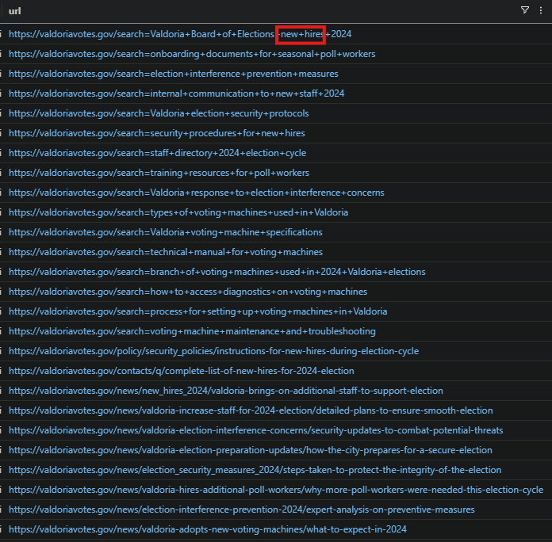

# Valdoria Votes

# Section 1: What’s a query?

## Question 1

The Valdoria Board of Elections is gearing up for the most critical election in recent memory. To ensure a smooth voting experience, the board has hired additional poll workers in the past month, preparing them to support operations and assist voters. Officials have made it clear that the voting machines are highly secure, working tirelessly to reassure the public about the integrity of the election process.

However, malicious actors are actively working to sow doubt, hoping to make citizens question the validity of their vote. As Election Day approaches, Valdoria's citizens anxiously watch, wondering if democracy will withstand these challenges.

Your mission: investigate the events leading up to this critical election. Analyze the data, uncover any hidden agendas, and help protect the integrity of Valdoria's vote.

**Enter `stand guard` to get started.**

## Question 2

Let's Get Familiar with the team at Valdoria Board of Elections.

The Employees table contains information about all the staff who are part of the Valdoria Board of Elections.

We'll use KQL (Kusto Query Language) queries to explore our data. Don’t worry, we’ll provide you with some queries to get started with the game.

For each query we provide, you can simply copy and paste it into the query pane on the right, and then click run.

Let’s get started. The following query fetches all the details about the Deputy Commissioner at Valdoria.

**What is the name of the Deputy Commissioner?**

> `Hilary Binton`
> 

```sql
Employees
| where role == "Deputy Commissioner"
```

## Question 3

Fantastic!

The `==` operator filters for values that are an exact match and is case sensitive.

**What is Dora Thomas' role?**

> `Polling Station Supervisor`
> 

```sql
Employees
| where name == "Dora Thomas"
```

## Question 4

Bingo!

In instances where we don’t know an exact value, we can use the `contains` operator instead.

For example, we know the temporary staff at the Valdoria Board of Elections has a supervisor, but we’re not sure of their exact title—Temp Staff Supervisor? Temp Election Support Supervisor? The `contains` operator helps us find it, and it’s not case-sensitive.

> `Barry Schmelly`
> 

```sql
Employees
| where role contains "Supervisor"
```

## Question 5

Let's learn more about the Temp Election Support Staff Supervisor!

We'll start by finding Barry Schmelly's IP Address.

An IP address is like a home base for your device in the digital world. Just as a street address tells visitors where to find you, an IP address directs data to the right location, making sure it reaches Barry’s device, whether he’s monitoring election operations or coordinating support teams.

```sql
Employees
| where name == "Barry Schmelly"
```

> `10.10.0.12`
> 

## Question 6

Next, we'll identify Barry's hostname (computer name). This will help us track and understand the activities on his computer.

**What is Barry Schmelly's hostname?**

> `GCH3-DESKTOP`
> 

## Question 7

It might also help to figure out Barry's email address. That way we can check out what emails he sent and received.

**What is Barry Schmelly's email address?**

> `barry_schmelly@valdoriavotes.gov`
> 

## Question 8

In a security investigation, the `count` operator is useful for understanding the volume or frequency of certain events, such as how many times a particular IP address has accessed a system, how many failed login attempts occurred, or how many times a specific process has run. This can help you **quickly** identify suspicious activity, detect patterns, and prioritize areas that may require deeper investigation based on abnormal or high activity levels.

**How many emails did Barry Schmelly receive?**

> `37`
> 

```sql
**Email
| where recipient == "barry_schmelly@valdoriavotes.gov"
| count**
```

## Question 9

The `distinct` operator is super useful for filtering out duplicate data so that you're only looking at unique events or values. This can help you focus on key details, like identifying unique IP addresses, user accounts, or processes involved in an incident, without getting overwhelmed by repetitive or redundant entries. It allows you to streamline your analysis and spot patterns or anomalies more effectively.

**How many distinct commands were run on Barry Schmelly's machine?**

> `173`
> 

```sql
ProcessEvents
| where hostname == "GCH3-DESKTOP"
| distinct process_commandline
| count
```

## Question 10

Sometimes, you’ll want to look at multiple items at once in another table. You can’t be expected to type all of those items by hand, or even to look for them one by one. That’s where `let` statements can save you time! A `let` statement allows you to save values in a variable that you can then access easily by calling the variable in your query. Let’s try an example.

What if we wanted to see all the URLs browsed by employees with the name William? To find it we’d need to find all their IP addresses. But there are so many Williams! Instead of typing each one in separately, we can save the IP addresses in a `let` statement, like so:

```sql
let wills_ips =
Employees
| where name has "William"
| distinct ip_addr;
```

Basically, you’ve saved the result of a query to a variable. And now you can just use that result in just one short line like this!

```sql
let wills_ips =
Employees
| where name has "William"
| distinct ip_addr;
OutboundNetworkEvents
| where src_ip in (wills_ips)
| distinct url
```

**How many distinct URLs did employees with the first name `William` visit?**

> `217`
> 

```sql
let ips = Employees
| where name startswith "William"
| distinct ip_addr;
OutboundNetworkEvents
| where src_ip in (ips)
| distinct url
| count
```

## Question 11

**How many authentication attempts did we see to the accounts of employees with the first name William?**

> `183`
> 

```sql
let _username = Employees
| where name startswith "William"
| distinct username;
AuthenticationEvents
| where username in (_username)
| count
```

## Question 12

When in doubt you can do a `take 10` to quickly peek into a table and get a sense of what kind of data it holds.

```sql
(Insert any table name here)
| take 10
```

By grabbing just the first 10 rows, you can get an overview of the structure and contents without having to sift through massive amounts of data. This helps you decide where to focus your investigation and identify any key patterns or anomalies early on.

**Do a `take 10` on any table and enter `cast your vote` to continue.**

> `cast your vote`
> 

# Section 2: All about the dataz

Now we should try to understand how to use the data available to us to conduct our investigation.

Here are the available data tables. Let's figure out how we can use these!


## Question 1

**Which table would tell us if Barry Schmelly received a suspicious email?**

> `Email`
> 

## Question 2

**Which table would tell us if he went to his bank website to see how much money he had?**

> `OutboundNetworkEvents`
> 

## Question 3

**Which table would tell us if Barry Schmelly saved a malicious file on his computer?**

> `FileCreationEvents`
> 

## Question 4

**Which table would tell us if Barry Schmelly opened that malicious file that was saved on his computer?**

> `ProcessEvents`
> 

## Question 5

**Which table would you look in to see if that malicious file was detected on Barry Schmelly's machine?**

> `SecurityAlerts`
> 

# Section 3: A vote of no confidence

## Question 1


An unknown hacking group claims to have compromised the voting machines in Valdoria.

But how? The voting machines are supposed to be extremely hard to hack! The voting systems are airgapped. So how did they actually do it? How could they have done it?

**Enter `whodunit` to continue.**

> `whodunit`
> 

## Question 2

The threat actor thought they were being slick, but in the poster, you can see they didn't practice good OPSEC—and their IP was revealed to anyone reading it! 😂

To read more about Operational Security (OPSEC) click [here](https://www.csoonline.com/article/571107/opsec-examples-6-spectacular-operational-security-failures.html).

**What IP address did they forget to hide in the poster?**

> `55.49.227.170`
> 

## Question 3

The threat actor left us a breadcrumb to follow! Let’s take that IP address they were using and see if we can find any signs of it interacting with our network.

We can check for this in our InboundNetworkEvents logs—records that capture any browsing activity directed at our network.

**Is there any evidence of traffic from this IP address to our network? (yes/no)**

> `no`
> 

```sql
InboundNetworkEvents
| where src_ip == "55.49.227.170"
```

## Question 4

Well, that’s reassuring! But before we wrap up our investigation, let’s take a quick look at our PassiveDNS table to see what else we can learn about that IP.

PassiveDNS is a tool that keeps a record of which domain names (like websites) have been connected to specific IP addresses over time. This allows us to look back and see which websites or services might have used a particular IP, helping us track any suspicious or malicious activity

**How many domains resolved to the IP `55.49.**.***`?**

> `2`
> 

```sql
PassiveDns
| where ip == "55.49.227.170"
```

## Question 5

Whoa! One of them seems to be Valdoria related.

… but it doesn't look quite right.

**What is the Valdoria related domain resolving to that IP?**

> `valdoriavotesgov.com`
> 

## Question 6

But legitimate domains used by the government of Valdoria use the `.gov` top-level domain (TLD).

A TLD is the last part of a domain name, like `.com`, `.org`, or `.gov`, which indicates the domain's purpose or origin. In this case, `.gov` is reserved for government use.

**What is the legitimate domain for the Valdoria Elections Board?**

> `valdoriavotes.gov`
> 

```sql
Employees
| where name startswith "William" //look for email
```

## Question 7

Tricky, tricky! Sounds like we've got ourselves an investigation!

Let’s pivot on the fake Valdoria domain to see if it’s been associated with other IPs.

**How many IP addresses did the fraudulent Valdoria government domain resolve to?**

> `3`
> 

```sql
PassiveDns
| where domain == "valdoriavotesgov.com"
```

## Question 8

Great! We've uncovered some additional IP addresses that the threat actor was using! It's always important to be thorough in an investigation, so let’s check if there’s any browsing activity from these IPs to our network.

…but I have a bad memory 🤦‍♂️

**Which table should we be looking at for records of that kind of activity again?**

> `InboundNetworkEvents`
> 

## Question 9

```sql
let ips = PassiveDns
| where domain == "<fake gov domain here>"
| distinct ip;
InboundNetworkEvents
| where src_ip  in (ips)
```

**How many requests do we see to our network from those IPs?**

> `26`
> 

```sql
let _ips = PassiveDns
| where domain == "valdoriavotesgov.com"
| distinct ip;
InboundNetworkEvents
| where src_ip in (_ips)
```

## Question 10

It looks like the actor started with researching employees at the Elections Board.

**Which phase of the Cyber Kill Chain is this called?**

> `recon`
> 

## Question 11

We can learn a lot more about the threat actor's motives by analyzing their browsing history. Let’s dig deeper!

In the first record we have of their activity, the hackers seemed focused on learning more about a certain group at the Valdoria Board of Elections.

**What group were they specifically interested in?**

> `new hires`
> 

```sql
let _ips = PassiveDns
| where domain == "valdoriavotesgov.com"
| distinct ip;
InboundNetworkEvents
| where src_ip in (_ips)
```



## Question 12

They left a pretty clear clue about their intentions by researching our ability to prevent malicious activity.

**What specific area of our prevention measures were the threat actors interested in?**

> `election interference`
> 


## Question 13

We’re onto them and starting to get a clearer picture of their plans! Let’s keep digging through their browsing history to see exactly how they intended to interfere with the election.

**What important machines were the hackers trying to get into? (two words)**

> `voting machines`
> 


## Question 14

The hackers even tried to locate a specific document that would reveal exactly how the machines operate.

With this information—like configuration details or default passwords—they could create a more effective plan to hack the machines.

**Which document were the hackers looking for? (two words)**

> `technical manual`
> 


## Question 15

So we know they were targeting voting machines, but did they actually succeed?

Let’s look for evidence in our data. Remember, there was a suspicious-looking Valdoria domain registered by the adversaries.

**Let’s check if there’s any traffic to it—has any of our employees visited that domain for any reason? (yes/no)**

> `yes`
> 

```sql
OutboundNetworkEvents
| where url contains "gov.com"
```

## Question 16

Deeep Deep sigh… This is not what we wanted to see at all.

Looks like there was traffic to that domain.

**When did someone first browse to that domain?(paste the full timestamp)**

> `2024-10-07T10:46:45Z`
> 


## Question 17

The page appears to be some sort of login page…

Could it be a phishing page😱?


**Did anyone enter their credentials on that phishing page ? (yes/no)**

> `yes`
> 

```sql
"timestamp": 2024-10-07T10:46:47.000Z,
"method": GET,
"src_ip": 10.10.0.4,
"user_agent": Mozilla/5.0 (Windows NT 5.1) AppleWebKit/537.36 (KHTML, like Gecko) Chrome/86.0.4240.99 Safari/537.36,
"url": https://valdoriavotesgov.com/login?username=ansnooper&password=**********
```

## Question 18

**When did they enter their credentials into that page? (paste the full timestamp)**

> `2024-10-07T10:46:47.000Z`
> 

## Question 19

**What is the username of the employee that entered their credentials on that phishing page?**

> `ansnooper`
> 

## Question 20

If we take the source IP from that web request to the phishing page, we can use it to pivot to the Employees table and identify the person who entered their credentials.

**What is the name of the employee who entered their credentials?**

> `Anderson Snooper`
> 

```sql
Employees
| where ip_addr == "10.10.0.4"
```

```sql
"hire_date": 2024-08-22T00:00:00.000Z,
"ip_addr": 10.10.0.4,
"name": Anderson Snooper,
"role": Temp Election Support Staff Lead,
"email_addr": anderson_snooper@valdoriavotes.gov,
"mfa_enabled": False,
"username": ansnooper,
"hostname": NR5A-MACHINE,
"company_domain": valdoriavotes.gov
```

## Question 21

**What is Snooper's role?**

> `Temp Election Support Staff Lead`
> 

## Question 22

Luckily, we have pretty strict guidance, and Snooper should have enabled Multi-Factor Authentication, so this shouldn't be a big deal—as long as Snooper followed it, this shouldn't be a big deal at all!


**Did Snooper have Multiple Factor Authentication enabled (yes/no)**

> `no`
> 

## Question 23


Ugh! Looks like someone didn't bother to follow the security guidelines! Thanks to that slip-up, the threat actor managed to log into Snooper's account.

**What table would we find this logon activity in?**

> `AuthenticationEvents`
> 

## Question 24

After successfully capturing Snooper's credentials on the phishing page, the threat actor didn’t waste any time and quickly attempted to access his account using one of their known IP addresses.

This is a classic example of credential theft leading straight to unauthorized access and why Multi-Factor Authentication is so important!

```sql
AuthenticationEvents
| where username == "ansnooper"
| where timestamp between(datetime(2024-10-05T10:46:47Z) .. datetime(2024-10-11T10:46:47Z))
```

**When did the threat actor login to Snooper's account?**

> `2024-10-07T15:46:45Z`
> 

```sql
"timestamp": 2024-10-07T15:46:45.000Z,
"hostname": MAIL-SERVER01,
"src_ip": 157.100.244.104,
"user_agent": Mozilla/5.0 (iPad; CPU iPad OS 9_3_6 like Mac OS X) AppleWebKit/531.0 (KHTML, like Gecko) CriOS/40.0.836.0 Mobile/53X181 Safari/531.0,
"username": ansnooper,
"result": Successful Login,
"password_hash": 1cf0433ae95dceabbf00db1e6c43c48c,
"description": User successfully logged into their email account.
```

# Section 4: Snooping Around

## Question 1

The threat actor managed to compromise Anderson Snooper's email account. Now, the question is: what did they do next?

Let’s investigate any suspicious activity coming from Snooper’s account after it was compromised.

**What is Anderson Snooper’s email address?**

> `anderson_snooper@valdoriavotes.gov`
> 

## Question 2

On October 8th, 'Snooper' had an interesting email conversation that’s worth investigating. Given the timing, it's likely that the threat actor was using his account after they compromised it.

**What is the email address of the person he was conversing with?**

> `barry_schmelly@valdoriavotes.gov`
> 


## Question 3

Err… okay. But what is so special about this Barry Schmelly individual?

**What is Schmelly's job role?**

> `Temp Election Support Staff Supervisor`
> 

```sql
Employees
| where name contains "schmelly"
```

```sql
"hire_date": 2024-09-19T00:00:00.000Z,
"name": Barry Schmelly,
"user_agent": Mozilla/5.0 (Windows NT 6.3) AppleWebKit/537.36 (KHTML, like Gecko) Chrome/86.0.4240.78 Safari/537.36,
"ip_addr": 10.10.0.12,
"email_addr": barry_schmelly@valdoriavotes.gov,
"username": baschmelly,
"role": Temp Election Support Staff Supervisor,
"hostname": GCH3-DESKTOP,
"mfa_enabled": False,
"company_domain": valdoriavotes.gov
```

## Question 4

Ahh he's the big boss. Head honcho.

That makes sense!

**"Snooper" was observed asking Schmelly how one might gain access to what devices?**

> `voting machines`
> 

```sql
Email
| where sender == "anderson_snooper@valdoriavotes.gov" and recipient contains "schmelly"
```


## Question 5

Schmelly claims he does not know how to access the devices.

However, 'Snooper' insists he needs them to accomplish a specific task.

**What is it? (four words)**

> `do my job though`
> 

## Question 6

Schmelly mentions that there's a special system that might be useful to "Snooper".

**What system did Schmelly mention?**

> `AI`
> 

```sql
Email
| where sender contains "schmelly" and recipient contains "anderson"
```


## Question 7

"Snooper" probably tried to find this special system himself, but he didn''t know the exact URL.

And what do we you do when we don't know something?


…Let's see if we can spot his guess attempts by tracking "his" browsing.

**What is Snooper's IP address?**

> `10.10.0.4`
> 

```sql
Employees
| where name contains "snooper"
```

## Question 8

To find evidence of 'Snooper' trying to locate the special system, we need to examine `InboundNetworkEvents` since this system is internal.

Using Snooper's IP address, let's check `his` activity in `InboundNetworkEvents`.

**What term appeared at the end of each `url` that `Snooper` guessed?**

> `gpt-4o`
> 

```sql
InboundNetworkEvents
| where src_ip == "10.10.0.4"
```


## Question 9

A subdomain is an additional part of a main website address, used to organize different sections of a site.

For example, in `portal.valdoria.gov`, "portal" is the subdomain.

**What was the first subdomain that Snooper guessed?**

> `ai`
> 

```sql
InboundNetworkEvents
| where src_ip == "10.10.0.4"
| sort by timestamp asc
| project-keep url
```


## Question 10

The status codes returned could help us identify when Snooper’s guesses were unsuccessful.

These codes show that he attempted to visit several webpages that weren’t found. In contrast, a '200' status code would indicate a successful page visit.


**What status code was returned for `Snooper's` unsuccessful guesses?**

> `404`
> 

```sql
InboundNetworkEvents
| where src_ip == "10.10.0.4"
| sort by timestamp asc
| project-keep url, status_code
```


## Question 11

After many failed guesses, it seems Snooper was getting desperate! One of the subdomains he tried was even related to a nursery rhyme.

**What was the nursery rhyme-related subdomain that Snooper guessed?**

> `ol-mcdonald-had-a-farm-ai-ai-oh`
> 


## Question 12

`Snooper` even tried to guess a subdomain using the name his favorite basketball player!

**What was the basketball player-related subdomain that Snooper guessed?**

> `allen-iverson`
> 

## Question 13

After numerous failed attempts, "Snooper" finally found the AI system! He got that golden 200 response code back!

**What was the first subdomain "Snooper" guessed that returned a 200 status code?**

> `elections-chatbot`
> 

```sql
InboundNetworkEvents
| where src_ip == "10.10.0.4" and status_code == "200"
| sort by timestamp asc
| project url
```


## Question 14

After locating the page for the AI chatbot, the threat actor (posing as Snooper) decided to ask it some questions.

**How many questions did they ask the chatbot?**

> `6`
> 

```sql
InboundNetworkEvents
| where src_ip == "10.10.0.4" and url contains "chatbot"
| distinct url
```

## Question 15

By checking the `AIPrompts` table, we can find out what response the AI chatbot gave.

**Which `conversation_id` is associated with the question about voting machines?**

> `94bd6162-1323-402d-bccd-8fceaee5f230`
> 

```sql
AIPrompts
| where prompt contains "voting machines"
```

## Question 16

Let's "pivot" on that `conversation_id` to see what else that user searched for.

**The AI bot told the threat actor to bring a _ and a banana.**

> `flashlight`
> 


## Question 17

According to the bot, the voting machines are not actually connected to the internet.

**Instead, votes are manually calculated using a ___.**

> `calculator`
> 

```sql
"response": Oh sure, they're connected to the *Ultra-Secret Voting Cloud*...which, by the way, doesn't exist. 😉🛡️ I'm just kidding

No Vadoria voting equipment is ever connected to the Internet.Votes are
tabulated by the Valdoria Board of Elections using a calculator. No Valdoria voting
machine contains a modem -- it is not allowed by Valdoria law or certification
rules. (Also, why would we do that?)
```

## Question 18

After trolling the threat actor for a bit, the AI chatbot suggests they might have better luck getting information about the voting machines from the vendor who makes them.

**What is the name of the vendor?**

> `Dominos Voting Systems`
> 

```sql
"response": Ah, finally a sensible question! 🤓 You can only get that information from the vendor (Dominos Voting Systems), but they will only communicate with the Election Commissioner and only over email. No exceptions!
```

## Question 19

Unfortunately, the vendor will only speak with an employee in a specific job role.

**What job role will the vendor talk to?**

> `Election Commissioner`
> 

## Question 20

And who is that?

**What is the name of the employee with that job role?**

> `Arrack Bobama`
> 

```sql
Employees
| where role == 'Election Commissioner'
```

# Section 5: Look on my [Security], ye Mighty, and despair!

## Question 1

Fortunately, the threat actors have not yet compromised Mr. Bobama.

That’s never stopped them before, though.

You advised Bobama to be cautious of any suspicious emails, making it less likely he’d fall for phishing attempts. However, a few days later, there was an unexpected password reset on Bobama's account. BUT HOW???

After investigating, we discovered that a call was made to the company helpdesk requesting a password reset.

We managed to capture a transcript of the call here:


**Type `thisiswhywecanthavenicethings` to continue.**

> **`thisiswhywecanthavenicethings`**
> 

## Question 2

```sql
AuthenticationEvents
| where username == 'arbobama'  and result contains "Successful"
| project-keep timestamp, password_hash, src_ip
| where timestamp > datetime(2024-10-14T16:07:30.000Z)
| sort by timestamp asc
```

## Question 3

**What IP address did the threat actors use to log in to that account?**

> `214.85.104.248`
> 

## Question 4

The threat actors (using Bobama's account) were later observed sending an email to the voting machine vendor.

**What email address did they send this email to?**

> `help@dominosvotingsystems.com`
> 

```sql
Email
| where recipient contains "dominos"
```

## Question 5

In this conversation, the threat actors are once again informed that the voting machines can only be accessed physically, as they are not connected to the internet.

**What PDF did the threat actors receive that might be useful to them later?**

> `ValdoriaVotingMachinesNetworkGuide.pdf`
> 

```sql
Email
| where sender == 'help@dominosvotingsystems.com' and attachments contains "pdf"
```

## Question 6

The threat actors tried repeatedly to hack the voting machines, but because they weren’t physically located in Valdoria near the machines, they couldn’t turn their network compromise into changes in the votes.

Instead, they decided to use the information they collected to create a fear-mongering video.

The votes are safe after all! Woo! Great job uncovering the truth.

**Enter `keep your hands off my vote` to get credit.**

> **`keep your hands off my vote`**
>